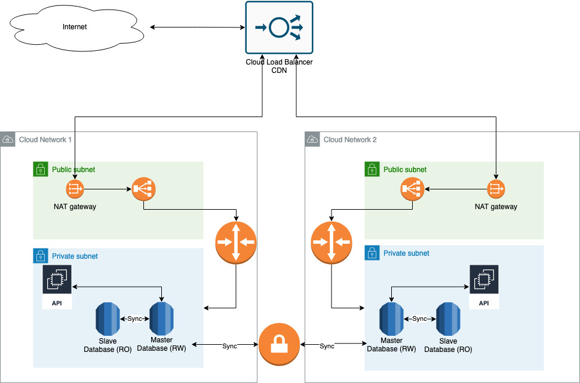

# Infrastructure

Infrastructure can be deployed using IaC in a modular way to deploy and manage a multi cloud architecture.

Below is what I would suggest as a solution to support a multi cloud solution with high availability database:

