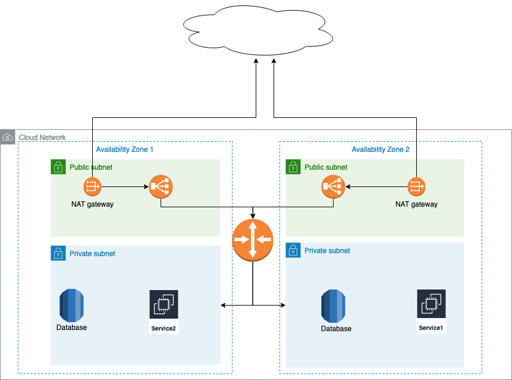

# Networking and security

No direct inbound connections should be allowed to the remote machines, specially the database. Usually the network has minimum two subnets:

- **Public subnet:** The subnet's traffic is routed to an internet gateway or an egress-only internet gateway and can reach the public internet.
- **Private subnet:** The subnet’s traffic is not routed to an internet gateway or egress-only internet gateway and cannot reach the public internet.

_Configuration tool:_

- If the deployment is manual via script (ANSIBLE, Bash,...), a bastion instance should be available in the public subnet to communicate with DB and deploy/update services.
- Alternative solution is to use Ansible Tower configured and installed in the public subnet of the network.

This approach require more manual interventions for deploying updates and services. Another disadvantage is lack of any notion of state!
To deploy updates and service install I would prefer using helm charts v3.
