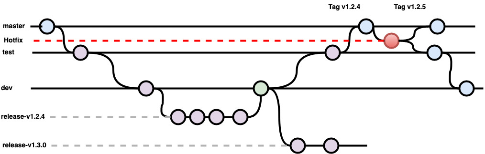

# CI/CD

The below is to give an idea on how it can be done, it can be adapted and customized depending on the requirements and needs.

Example of what can be changed:

- Pipeline stages (regression testing, code security scan, ...)
- Deployment technique (blue green, canary, rolling)
- Git branches
- Application environments
- Automated stages vs manual stages

## Git

The pipeline is based on GitOps, to start I would split my git branched according to the main environment:

- dev branch (Development environment)
- test branch (Test/QA/Staging environments)
- master branch (Production/Demo environments)
We have 3 main (protected) git branches, each branch can only be updated by a PR.
The pipeline is triggered only on PR and on merge.

## Pipeline and scenarios

The basic scenario goes like this:

At any time the pipeline fails, deployment won't happen or revert back.

### dev
Here's how it works, we start by the development. A feature branch is checked out from the dev branch.
When a PR is created, the pipeline will do the below stages:

- Compile/build the code
- Unit testing
- BDD (e.g Cucumber)
- Test DB migration (e.g Flyway)
- Security scan

If all the tests pass and PR reviewed by a team lead, the feature branch can be merged to the dev branch!

This way we guarantee a clean and working code to the main branch.

Once the branch is merged to dev, the pipeline is triggered to do the below:

- Compile/build the code
- DB migration
- Build container image
- Scan container image and push it to Docker registry
- Deploy to dev environment/cluster

If all went well, the feature branch is now deployed on the development environment!

### test
Moving forward with the pipeline, a PR request is created to merge the dev branch into test branch.
The pipeline is triggered and will do the below stages:

- Compile/build the code
- Test DB migration
- QA smoke testing (Selenium/Newman)

If all the tests pass and PR reviewed by a team lead, the PR can be merged to the test branch!
Once the branch is merged to test, the pipeline is triggered to do the below:

- Compile/build the code
- DB migration
- Build container image
- Deploy to test/QA environment/cluster

### master
Moving forward with the pipeline, a PR request is created to merge the test branch into master branch.
The pipeline is triggered and will do the below stages:

- Compile/build the code
- Test DB migration
- QA regression testing (Selenium/Newman)

If all the tests pass and PR reviewed by a team lead, the PR can be merged to master branch!
For production deployment usually I prefer triggering it manually, preventing accidental merge and in a microservice architecture often there is a deployment order to follow. Manual production deployment will give the team leads the flexibility to do so.

- Compile/build the code
- DB migration
- Build container image
- Deploy to production/demo environment/cluster
